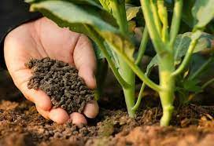
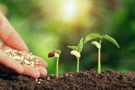
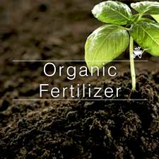
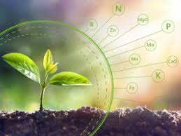

# Organic Farm Website

Welcome to the README file for the Organic Farm website. This document provides an overview of the website's structure and content.

## Table of Contents
- [Organic Farm Website](#organic-farm-website)
  - [Table of Contents](#table-of-contents)
  - [About Us](#about-us)
  - [Contact Us](#contact-us)
  - [Services](#services)
  - [Fertilizer Information](#fertilizer-information)
  - [Crops](#crops)
  - [Additional Information](#additional-information)

## About Us
The "About Us" page provides information about our organic farm's history, mission, and values. It introduces visitors to our commitment to sustainable farming practices and the team behind our success.

## Contact Us
The "Contact Us" page allows visitors to get in touch with us. It includes our contact details, such as our physical address, phone number, and email address. Additionally, a contact form is available for inquiries and feedback.

## Services
The "Services" page outlines the range of services we offer, including:

- **Fertilizer Sales**: Information on the various organic fertilizers we provide, their benefits, and how to purchase them.
- **Crop Consulting**: Details about our consulting services, where we offer expert guidance on crop management, pest control, and organic farming techniques.
- **Workshops and Training**: Upcoming workshops, training sessions, and events related to organic farming practices.
- **Farm Tours**: Information on guided tours and educational experiences on our farm.

## Fertilizer Information
Our website contains extensive information about organic fertilizers. Visitors can learn about the importance of organic fertilizers, their benefits for different crops, and how to choose the right fertilizer. We also offer a catalog of available organic fertilizers for sale.

## Crops
The "Crops" section serves as a valuable resource for farmers and gardeners. It provides in-depth information on various crops suitable for organic cultivation. This includes crop-specific planting guides, care instructions, and tips for maximizing yields while maintaining organic integrity.

## Additional Information
- **Blog**: Our website features a regularly updated blog with articles, tips, and insights on organic
